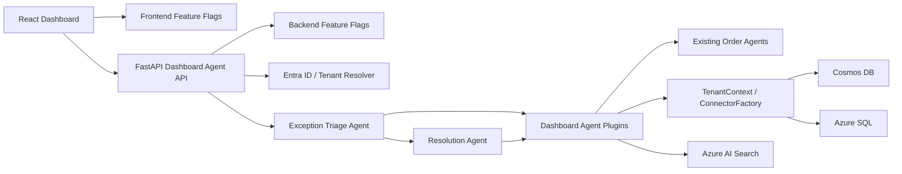
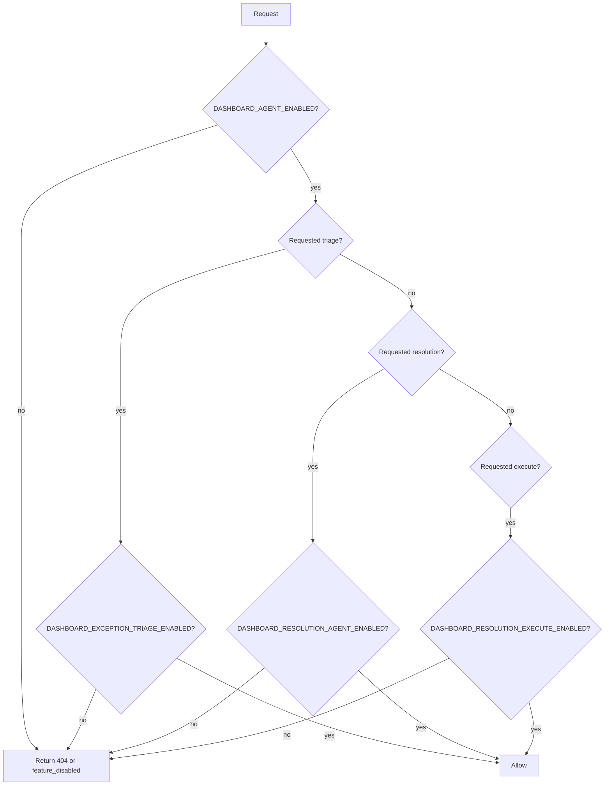

# ダッシュボードAgent設計

> Exception Triage Agent / Resolution Agent をダッシュボードに搭載するための機能計画・アーキテクチャ・Feature Flag設計。

## 目的

ダッシュボード側Agentは、受注チャネルから届いた注文を自動処理するAgentではなく、担当者が例外注文を短時間で判断し、安全に対応するためのAgentとして設計する。

foogent の価値は「受注を自動化する」だけではなく、誤発注・欠品・曖昧注文を見逃さず、担当者の承認を経て次回以降の自動化率を上げることにある。そのため、ダッシュボードには汎用チャットではなく、次の2つの業務Agentを搭載する。

| Agent | 役割 | 主な成果物 |
|---|---|---|
| **Exception Triage Agent** | 確認が必要な注文を検出し、理由・優先度・根拠を整理する | 例外一覧、優先度、判断理由、参照データ |
| **Resolution Agent** | 例外注文への対応案を作成し、人間承認後に実行する | 修正案、代替品案、返信文案、学習更新案 |

## Agentを使う理由

KPI表示、固定フィルタ、在庫不足一覧などは通常のAPI・SQL・UIロジックで実装する。Agentを使う対象は、複数データソースと業務文脈を横断して判断し、次の対応案まで組み立てる処理に限定する。

| 機能 | Agent要否 | 理由 |
|---|---:|---|
| 本日の受注件数、確認待ち件数 | 不要 | 集計APIで十分 |
| ステータス別フィルタ | 不要 | UI状態とAPIクエリで十分 |
| 異常数量の理由説明 | 必要 | 顧客別履歴、商品単位、過去統計、今回注文を横断するため |
| 在庫不足時の代替提案 | 必要 | 在庫、商品属性、顧客傾向、配送条件を組み合わせるため |
| 顧客への確認メッセージ生成 | 必要 | 注文文脈とチャネル別トーンを反映するため |
| 学習パターン更新案 | 必要 | 過去解釈と今回の人間承認を接続するため |

## 想定ユーザー

| ユーザー | 課題 | Agentによる支援 |
|---|---|---|
| 受注担当者 | 朝のピーク時に確認待ち注文が集中する | 優先度順に見るべき注文を提示 |
| 管理者 | 誤発注・欠品対応の品質を標準化したい | 根拠つきの対応案と監査ログを残す |
| テナント運用担当 | 顧客ごとの表現ゆれを継続的に学習させたい | 承認済みの解釈を学習候補として提示 |

## ユースケース

### UC-01: 朝の確認待ちトリアージ

1. 担当者がダッシュボードを開く。
2. 受注一覧に本日の注文が表示される。
3. Exception Triage Agent が確認待ち・異常検知・在庫不足・返信待ちを取得する。
4. Agent が優先度順に例外注文を整理する。
5. 担当者は「高リスク」から順に確認する。

**判定例**

| 注文 | 検知理由 | 優先度 |
|---|---|---|
| トマト150kg | 顧客平均15kgに対して10倍 | 高 |
| 卵5パック | 在庫不足、代替候補あり | 中 |
| ツナ缶100g | 通常単位と不一致、過去パターンあり | 中 |
| LINE返信待ち | 確認質問から2時間経過 | 低 |

### UC-02: 異常数量の修正案作成

1. 担当者が異常注文を選択する。
2. Exception Triage Agent が理由を説明する。
3. Resolution Agent が修正案を作成する。
4. 担当者がプレビューを確認する。
5. 承認後、受注ドラフトを更新し、必要に応じて顧客へ確認メッセージを送る。

**出力例**

```json
{
  "type": "order_update_draft",
  "reason": "過去24回の平均注文数量は15kgで、最大値は30kgです。",
  "proposed_changes": [
    {
      "field": "items[0].quantity",
      "before": 150,
      "after": 15
    }
  ],
  "customer_message": "トマト150kgのご注文ですが、通常は15kg前後です。15kgでお間違いないでしょうか？"
}
```

### UC-03: 在庫不足の代替提案

1. 在庫不足注文を選択する。
2. Resolution Agent が `IInventoryService.find_alternatives` を呼び出す。
3. 商品属性、温度帯、顧客の過去採用履歴を踏まえて代替候補を並べる。
4. 担当者は代替提案の返信文を承認する。

### UC-04: 曖昧表現の学習承認

1. 顧客が「ツナ缶100g」と注文する。
2. Intake Agent は過去パターンから「ツナ缶1個」の可能性を出す。
3. Exception Triage Agent は「確認が必要」と判定する。
4. 担当者または顧客が承認する。
5. Resolution Agent は Learning Service に渡す学習更新案を作成する。
6. 承認後、Order Intelligence Store の confidence を更新する。

### UC-05: 返信待ちタイムアウトの対応

1. LINE確認質問後、一定時間返信がない。
2. Exception Triage Agent がセッション状態を確認する。
3. Resolution Agent が再送文または担当者架電案を作成する。
4. 担当者が送信・保留・キャンセルを選ぶ。

## 画面設計

### 推奨UI

ダッシュボードには右サイドパネル型の「確認待ちトリアージAgent」を配置する。汎用チャットを主役にせず、例外カードと承認可能なアクションを中心にする。

```
┌──────────────────────────────────────────────────────────────────┐
│ Header: tenant / date / user                                      │
├────────────┬───────────────────────────────────┬─────────────────┤
│ Navigation │ 本日の受注                         │ Agent Panel     │
│            │ KPI / filters / order table        │                 │
│            │                                   │ 例外サマリ       │
│            │                                   │ 優先度カード     │
│            │                                   │ 修正案           │
│            │                                   │ 返信文案         │
│            │                                   │ 承認ボタン       │
└────────────┴───────────────────────────────────┴─────────────────┘
```

### UIコンポーネント

| コンポーネント | 内容 |
|---|---|
| Exception Summary | 確認待ち件数、高リスク件数、在庫不足件数 |
| Priority Queue | Agentが優先順位付けした例外注文カード |
| Evidence Panel | 過去平均、最大値、在庫数、会話履歴などの根拠 |
| Resolution Draft | 修正案、代替案、返信文案 |
| Approval Controls | プレビュー、承認、却下、保留 |
| Agent Activity Log | 実行したツール、参照したデータ、判断理由 |

## アーキテクチャ



### レイヤー別責務

| レイヤー | 責務 |
|---|---|
| Frontend | Agentパネル表示、例外カード表示、承認操作、Feature FlagによるUI出し分け |
| FastAPI | Agent API、認可、Feature Flag評価、Preview/Execute分離 |
| Agent | 例外判断、対応案生成、ツール呼び出し計画 |
| Plugin | Connector経由のデータ取得、更新プレビュー、承認済み実行 |
| Connector | テナント別DB/API差し替え、データアクセス |
| Data | 受注、セッション、学習パターン、監査ログ |

## Backend API設計

| メソッド | パス | 用途 | Feature Flag |
|---|---|---|---|
| GET | `/api/agent/features` | 有効なAgent機能を返す | 常時 |
| GET | `/api/agent/exceptions?tenant_id=T-001&delivery_date=YYYY-MM-DD` | 例外注文一覧 | `dashboard_exception_triage` |
| POST | `/api/agent/triage` | 選択範囲の例外分析 | `dashboard_exception_triage` |
| POST | `/api/agent/resolutions/preview` | 対応案のプレビュー生成 | `dashboard_resolution_agent` |
| POST | `/api/agent/resolutions/execute` | 承認済み対応案の実行 | `dashboard_resolution_execute` |
| GET | `/api/agent/audit-log` | Agent操作ログ | `dashboard_agent_audit_log` |

### Preview / Execute分離

Resolution Agent は直接DBを更新しない。更新系操作は必ず次の2段階に分ける。

1. **Preview**
   - Agentが対応案を作る。
   - 差分、理由、顧客返信文、影響範囲を返す。
   - DB更新やメッセージ送信は行わない。

2. **Execute**
   - 担当者が承認する。
   - APIが権限・Feature Flag・入力署名を検証する。
   - 承認済みアクションのみ実行する。
   - 監査ログを保存する。

## Plugin設計

Dashboard Agent 用に `src/plugins/dashboard_agent_plugin.py` を追加する想定。

| 関数 | 用途 | Read/Write |
|---|---|---|
| `list_exception_orders` | 確認待ち・異常・在庫不足を取得 | Read |
| `explain_exception_reason` | 例外理由と根拠を説明 | Read |
| `get_customer_order_profile` | 顧客の過去発注傾向を取得 | Read |
| `get_inventory_context` | 在庫と代替候補を取得 | Read |
| `draft_order_update` | 受注修正案を作成 | Preview |
| `draft_customer_message` | 顧客返信文を作成 | Preview |
| `draft_learning_update` | 学習パターン更新案を作成 | Preview |
| `execute_approved_resolution` | 承認済み対応を実行 | Write |
| `record_agent_audit_log` | 操作ログを保存 | Write |

更新系は `execute_approved_resolution` に集約し、任意のAgent出力をそのまま実行しない。実行可能なアクションはサーバー側で型定義された allowlist に限定する。

## データモデル

### ExceptionCase

```json
{
  "id": "exc-20260518-001",
  "tenant_id": "T-001",
  "order_id": "ord-001",
  "customer_id": "C-042",
  "type": "quantity_anomaly",
  "severity": "high",
  "status": "open",
  "reason": "通常15kg前後のところ150kgで注文",
  "evidence": {
    "avg_qty": 15,
    "max_qty": 30,
    "ordered_qty": 150,
    "z_score": 27
  },
  "created_at": "2026-05-18T07:30:00+09:00"
}
```

### ResolutionDraft

```json
{
  "id": "res-20260518-001",
  "exception_case_id": "exc-20260518-001",
  "type": "order_update",
  "status": "preview",
  "summary": "トマト150kgを15kgに修正する案",
  "proposed_actions": [
    {
      "action_type": "update_order_item_quantity",
      "order_id": "ord-001",
      "item_id": "item-001",
      "before": 150,
      "after": 15
    }
  ],
  "customer_message": "トマト150kgのご注文ですが、通常は15kg前後です。15kgでお間違いないでしょうか？",
  "requires_approval": true
}
```

### AgentAuditLog

```json
{
  "id": "aal-20260518-001",
  "tenant_id": "T-001",
  "user_id": "user-001",
  "agent_name": "ResolutionAgent",
  "action": "execute_approved_resolution",
  "target_type": "order",
  "target_id": "ord-001",
  "input_summary": "トマト150kgの異常注文を修正",
  "output_summary": "15kgへの修正案を承認実行",
  "tool_calls": [
    "get_customer_order_profile",
    "draft_order_update",
    "execute_approved_resolution"
  ],
  "created_at": "2026-05-18T07:35:00+09:00"
}
```

## Feature Flag設計

Agent機能はハッカソンデモ・本番運用・障害時切り戻しを考慮し、UI/API/実行権限の三層で制御する。

### Flag一覧

| Flag | デフォルト | 影響範囲 | 説明 |
|---|---:|---|---|
| `DASHBOARD_AGENT_ENABLED` | false | Frontend/API | ダッシュボードAgent機能全体 |
| `DASHBOARD_EXCEPTION_TRIAGE_ENABLED` | false | Frontend/API/Agent | Exception Triage Agent |
| `DASHBOARD_RESOLUTION_AGENT_ENABLED` | false | Frontend/API/Agent | Resolution Agent のPreview生成 |
| `DASHBOARD_RESOLUTION_EXECUTE_ENABLED` | false | API/Plugin | 承認済み対応案の実行 |
| `DASHBOARD_AGENT_AUDIT_LOG_ENABLED` | true | API/Plugin | Agent監査ログ |
| `DASHBOARD_AGENT_DEMO_MODE` | false | API/Frontend | デモ用サンプル応答を許可 |

### 評価順序



### Frontendでの扱い

- `GET /api/agent/features` の結果でAgentパネルを表示する。
- 全体Flagがoffの場合、既存ダッシュボードUIは変えない。
- Triageのみonの場合、例外サマリと理由説明だけを表示する。
- Resolution Previewがonの場合、修正案・返信文案を表示する。
- Executeがoffの場合、承認ボタンは非表示またはdisabledにする。

### Backendでの扱い

- 環境変数でFlagを評価する。
- API単位でFlagを検証し、offの場合は `404 Not Found` または `403 feature_disabled` を返す。
- `execute` 系APIは `DASHBOARD_RESOLUTION_EXECUTE_ENABLED=true` かつユーザー権限がある場合のみ許可する。
- デモ環境では `DASHBOARD_AGENT_DEMO_MODE=true` により、外部LLM呼び出しに失敗してもサンプル応答にフォールバックできる。

### 推奨デモ設定

```env
DASHBOARD_AGENT_ENABLED=true
DASHBOARD_EXCEPTION_TRIAGE_ENABLED=true
DASHBOARD_RESOLUTION_AGENT_ENABLED=true
DASHBOARD_RESOLUTION_EXECUTE_ENABLED=false
DASHBOARD_AGENT_AUDIT_LOG_ENABLED=true
DASHBOARD_AGENT_DEMO_MODE=true
```

ハッカソンデモでは、Previewまでを確実に見せる。実行まで見せる場合だけ `DASHBOARD_RESOLUTION_EXECUTE_ENABLED=true` にする。

## 安全性と権限

| リスク | 対策 |
|---|---|
| Agentが誤った修正を実行する | Preview/Execute分離、人間承認必須 |
| 誤った顧客に返信する | Execute時に order_id / customer_id / channel_user_id を再検証 |
| 不適切な学習が自動登録される | 学習更新も承認対象にする |
| 監査不能になる | AgentAuditLogを保存 |
| テナント越境 | TenantResolverとConnectorFactoryでtenant_idを固定 |
| Flag切り戻し不能 | UI/API/Executeを別Flagに分離 |

## 実装フェーズ

### Phase 1: Documentation / Mock

- 本設計ドキュメント作成
- UIイメージ作成
- Feature Flag方針合意

### Phase 2: Read-only Triage

- `GET /api/agent/features`
- `GET /api/agent/exceptions`
- Exception Triage Agent のRead-only実装
- ダッシュボード右パネル表示

### Phase 3: Resolution Preview

- `POST /api/agent/resolutions/preview`
- 修正案、代替案、返信文案の生成
- UI上のプレビューカード
- 監査ログのpreview記録

### Phase 4: Approved Execute

- `POST /api/agent/resolutions/execute`
- allowlistされたアクションのみ実行
- 受注更新、返信送信、学習更新
- 実行監査ログ

### Phase 5: Hardening

- Agent出力のJSON Schema検証
- e2eテスト
- 権限テスト
- Demo mode と本番modeの切り替え検証

## 成功指標

| 指標 | 目標 |
|---|---|
| 確認待ち注文の把握時間 | 受注一覧確認より短縮 |
| Agent提案の採用率 | デモシナリオで80%以上 |
| 自動確定率 | 学習更新により継続的に向上 |
| 誤実行 | Preview/Execute分離により0件 |
| デモ復旧性 | Feature Flag offで既存ダッシュボードへ即時復帰 |

## ハッカソンでの見せ方

5分デモでは、全機能を横並びで説明せず、次の一本の業務ストーリーに絞る。

1. LINE/電話から複数注文が入る。
2. 通常注文は自動確定される。
3. 異常数量・在庫不足・曖昧表現だけが確認待ちになる。
4. Exception Triage Agent が確認待ちを優先度順に並べる。
5. Resolution Agent が修正案・代替品案・返信文案を出す。
6. 担当者が承認する。
7. 学習パターンが更新され、次回から自動化率が上がる。

この構成により、Agentの価値を「チャット」ではなく「業務判断・安全な実行・継続学習」として示す。
