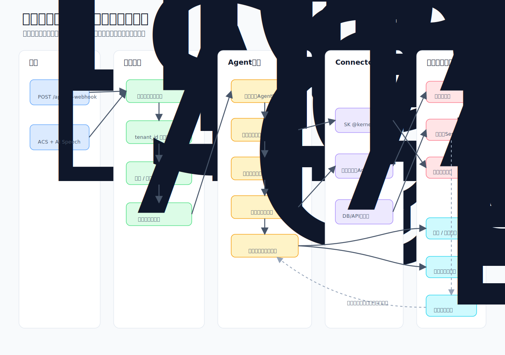

# データフロー詳細

> チャネル別処理フロー・セッション管理・スケール戦略

**MVP方針**: Azure Container Apps に API・Webhook・バックグラウンド処理を統合する。
FastAPI アプリケーションとして LINE Webhook 受信・Agent 呼び出し・Learning Service を
1コンテナで実装し、シンプルに運用する。
ダッシュボードはチーム開発効率のため API コンテナから分離し、Azure Storage Static Website で配信する。
Service Bus はスケール時（本番運用・マルチテナント）に導入する。

## ソフトウェア処理フロー図



## LINE チャネル（MVP実装対象）

```
顧客 → LINE メッセージ送信
    → LINE Webhook → Container Apps (FastAPI: POST /api/line-webhook)
    → 署名検証（Channel Secret で HMAC-SHA256）
    → テナントID解決（LINE公式アカウント → テナント紐付け）
    → セッション判定（後述「LINE会話セッション管理」）
        ├─ 既存セッションあり → 該当セッションのAgent Threadに返信を追記
        └─ 新規 → 新しいAgent Thread作成
    → Orchestrator Agent (Azure AI Agent Service)
        ├→ Intake Agent: 注文解析・顧客特定・パターン照合・商品正規化
        ├→ [必要に応じて] Exception Agent: 確認質問 / 異常検知
        ├→ Inventory Agent: 在庫照合
        └→ Communication Agent: 返信生成・LINE送信
    → Cosmos DB (受注ドキュメント保存)
    → Learning Service (非同期: パターン記録・プロファイル更新)
    → ダッシュボード更新 (リアルタイム)
```

## メール チャネル（将来実装）

詳細設計と実装タスクは [メールチャネル設計・実装計画](email-channel-design.md) を参照。

```
顧客 → メール送信
    → Microsoft Graph API (Office 365 Change Notifications)
    → Container Apps (通知受信・メール本文取得)
    → テナントID解決（受信アドレス → テナント紐付け）
    → Orchestrator Agent → 各専門Agent
    → Cosmos DB (保存)
    → Azure Communication Services でメール自動返信
    → Learning Service (非同期)
```

## 電話（音声）チャネル（MVP実装対象）

```
顧客 → 電話発信
    → ACS Call Automation (着信受付・音声ストリーム取得)
    → Azure AI Speech (リアルタイム文字起こし)
    → テナントID解決（着信番号 → テナント紐付け）
    → Container Apps → Orchestrator Agent → 各専門Agent
    → Cosmos DB (保存) + 担当者ダッシュボードに表示 + SMS通知
    → Learning Service (非同期)
```

## LINE会話セッション管理

確認質問→顧客返信の会話継続を実現するために、セッション管理が必要。
直近会話の保存・Agentへの渡し方は [LINE会話履歴参照設計](line-conversation-memory.md) を参照。

```
セッション管理テーブル（Cosmos DB: order-sessions）

{
  "id": "sess-U1234-20260515-001",
  "tenant_id": "T-001",
  "channel": "line",
  "channel_user_id": "U1234...",        // LINE User ID
  "customer_id": "C-042",
  "agent_thread_id": "thread_abc123",   // Azure AI Agent Service の Thread ID
  "status": "awaiting_reply",           // active / awaiting_reply / completed / expired
  "pending_order_draft": { ... },       // 確認中の注文ドラフト
  "created_at": "2026-05-15T07:15:00Z",
  "expires_at": "2026-05-15T09:15:00Z", // 2時間でタイムアウト
  "last_message_at": "2026-05-15T07:15:30Z"
}

フロー:
  1. LINE Webhook受信 → channel_user_id + tenant_id でセッション検索
  2. status=awaiting_reply のセッションがある
     → 既存の agent_thread_id に返信を追記
     → Orchestrator Agent が会話を継続（Thread内のコンテキストを保持）
  3. セッションがない or expired
     → 新しいセッション + Agent Thread を作成
     → 新規注文として処理開始
  4. 注文確定 → status=completed に更新
  5. タイムアウト → Container Apps のバックグラウンドタスク（APScheduler）で
     定期的に expired に更新
     → 担当者ダッシュボードに「返信待ちタイムアウト」として通知
```

## 受注→会話履歴の紐付け

受注詳細から元の注文会話（LINE/電話でのやり取り）を参照可能にするため、
Order ドキュメントに `session_id` を保持し、MessageHistory との紐付けを行う。

```
Order (Cosmos DB: order-documents)
  ├── session_id: "sess-U1234-20260515001"  ← セッションID（Optional）
  │
  └── → MessageHistory (Cosmos DB: message-history)
        WHERE session_id = @sid ORDER BY created_at ASC
        ├── { role: "user",      text: "りんご10箱お願いします" }
        ├── { role: "assistant", text: "りんご10箱、承りました。..." }
        └── { role: "user",      text: "はい、お願いします" }

API:
  GET /api/orders/{order_id}/messages
    → Order.session_id を取得
    → IMessageHistoryRepository.list_by_session_id() で会話取得
    → role が user/assistant のメッセージのみ返却
    → session_id が null（手入力受注等）の場合は空配列

ダッシュボード表示:
  受注詳細モーダル内にチャット形式で表示
  - user メッセージ: 左寄せ・グレー背景（「お客様」ラベル）
  - assistant メッセージ: 右寄せ・ブランドカラー背景（「AI」ラベル）
```

## 本番スケール時の構成変更

```
MVP構成:
  LINE Webhook → Container Apps (FastAPI) → Orchestrator Agent（直接呼び出し）

本番構成（マルチテナント・高負荷対応時に移行）:
  LINE Webhook → Container Apps → Service Bus (テナント別トピック)
              → Container Apps (別コンテナ/トリガー) → Orchestrator Agent

※ Service Bus を挟むことで:
  ・テナント間の負荷分離（1テナントの大量注文が他テナントに影響しない）
  ・デッドレターキューによる障害時のメッセージ保全
  ・ピーク時のバッファリング（朝の注文集中）
  が実現できる。MVP段階では不要。

※ Container Apps は 0→N のオートスケール対応済み（maxReplicas: 5）。
  朝のピーク時（6:30-8:00）のみスケールアウトし、アイドル時は0にスケールインする。
```
