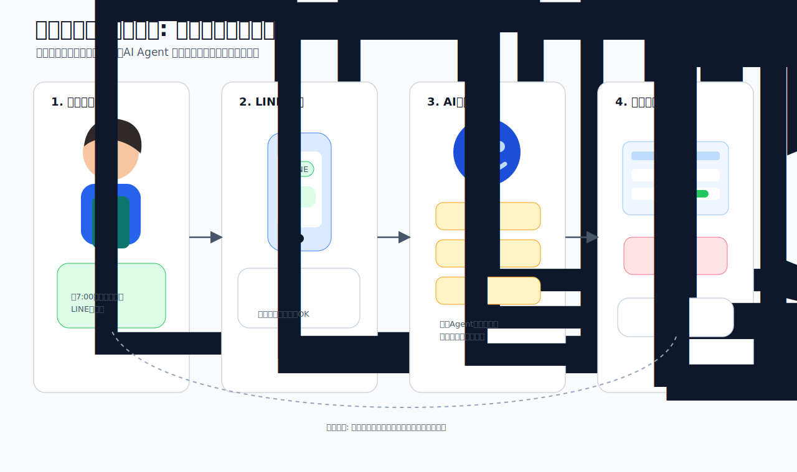

# MVPスコープ・ユーザー体験・非機能要件

> ハッカソン提出版のスコープ定義とユーザー体験シナリオ

## ユーザー体験フロー

### ペルソナ利用シナリオ図

### シナリオ1: 通常注文（即確定）

1. **朝7:00** ── 飲食店A店長からLINE: 「鶏もも肉 10kg、白菜 5ケース」
2. **Intake Agent** ── 顧客特定（A店 = C-012）、商品正規化、数量解析
3. **Inventory Agent** ── 在庫十分 → OK
4. **Communication Agent** ── LINE返信: 「ご注文承りました。鶏もも肉10kg、白菜5ケース、本日配送予定です」
5. **Learning Service** ── 確定注文を顧客プロファイルに反映（統計値を更新）
6. **結果** ── 受注確定・ピッキングリスト自動反映。担当者は確認するだけ

### シナリオ2: 単位の曖昧さ ── 初回は確認、次回から自動解釈

**【初回】**
1. **朝7:15** ── 飲食店B店長からLINE: 「ツナ缶100g」
2. **Intake Agent** ── `resolve_with_pattern` → パターンなし（初回）
3. **Exception Agent** ── 「ツナ缶は"個"単位（1個=70g）。100gは端数。確認が必要」
4. **Communication Agent** ── LINE返信: 「ツナ缶100gとのことですが、1個(70g)でよろしいですか？」
5. **店長返信** ── 「1個で！」
6. **Learning Service** ── パターン記録: `{C-015, "ツナ缶100g" → ツナ缶1個, confidence: 0.7}`

**【2回目】**
1. 同じB店長「ツナ缶100g」
2. **Intake Agent** ── `resolve_with_pattern` → HIT（confidence: 0.7、閾値0.9未満）
3. **Communication Agent** ── LINE返信: 「ツナ缶1個でよろしいですか？」（軽い確認のみ）
4. **店長返信** ── 「OK」
5. **Learning Service** ── confidence更新: 0.7 → 0.85

**【4回目以降】**
1. 同じB店長「ツナ缶100g」
2. **Intake Agent** ── `resolve_with_pattern` → HIT（confidence: 0.95、閾値超え）
3. → **確認なしで自動確定**。ツナ缶1個として即処理
4. **Communication Agent** ── LINE返信: 「ご注文承りました。ツナ缶1個、本日配送予定です」

### シナリオ3: 誤発注の自動検知

1. **朝7:30** ── 飲食店C店長からLINE: 「トマト150kgで」
2. **Intake Agent** ── 商品正規化OK、数量解析OK → 一見正常
3. **Exception Agent** ── `detect_quantity_anomaly`:
   - 過去パターン: 平均15kg、最大30kg、標準偏差5kg
   - 150kg → Zスコア = 27.0（閾値3.0を大幅超過）
   - 判定: **「誤発注の可能性が非常に高い」**
4. **Communication Agent** ── LINE返信: 「トマト150kgのご注文ですが、いつもは15kg前後です。数量をご確認いただけますか？」
5. **店長返信** ── 「ああ15kgの間違い！ありがとう」
6. **結果** ── 15kgで受注確定。**事故を未然に防止**

### シナリオ4: 「いつもの」注文 ── 学習済みパターンでフル自動

1. **朝6:45** ── 常連の飲食店D店長からLINE: 「いつものお願い」
2. **Intake Agent** ── `resolve_with_pattern(C-088, "いつもの")`
   - → 過去パターン: 毎週月曜に同じ注文（鶏もも肉20kg, キャベツ10ケース, 卵5パック）
   - → confidence: 0.98（高信頼）
3. → **確認なしで自動確定**
4. **Communication Agent** ── LINE返信:
   「いつものご注文承りました: 鶏もも肉20kg / キャベツ10ケース / 卵5パック。本日配送予定です」
5. **結果** ── 担当者出社前に処理完了

### シナリオ5: 複数チャネル同時着信（朝のピーク）

1. **朝6:30-7:00** ── LINE 8件 + メール 3件 + 電話 2件 = 13件同時
2. **Service Bus** ── 全件並列でキューイング
3. **各Agent** ── 並列処理（Azure Container Apps のオートスケール）
4. **Learning Service** ── 学習済みパターンにより13件中9件が自動確定
5. **担当者出社** ── ダッシュボードに全件処理済み一覧。**確認待ちはたった4件**

## MVP スコープ（ハッカソン提出版）

| Phase | 機能 | 実装方法 |
|---|---|---|
| **Must（デモ必須）** | Orchestrator + Intake Agent | Semantic Kernel（ChatCompletionAgent） |
| **Must** | Exception Agent（確認質問 + 異常数量検知） | 同上（Agenticらしさのデモの核心） |
| **Must** | Learning Service（パターン学習 + 自動解釈） | Cosmos DB (Order Intelligence Store) + Container Apps + Foundry Embedding |
| **Must** | LINE受信→注文抽出→自動返信 | LINE Webhook + Container Apps (FastAPI) |
| **Must** | 受注一覧ダッシュボード | Azure Storage Static Website + React/Vite |
| **Must** | Inventory Agent（在庫照合） | Azure SQL + Semantic Kernel Plugin |
| **Must** | テナント切り替えデモ | Connector Factory + 2テナント設定 |
| **Must** | 電話音声→テキスト変換→注文抽出 | ACS Call Automation + Azure AI Speech + Container Apps |
| **Should** | AI Search商品あいまい検索 | Azure AI Search |
| **Should** | ピッキングリストPDF生成 | Container Apps (バックグラウンドタスク) |
| **Could** | メール受信→注文抽出 | Microsoft Graph API (Office 365)。詳細: [メールチャネル設計](email-channel-design.md) |
| **Could** | メール自動返信 | 初期実装は Graph `sendMail`、運用分離が必要なら Azure Communication Services Email |

## 非機能要件

| 要件 | 対応 |
|---|---|
| **可用性** | Azure Container Apps の自動スケーリング（朝のピーク対応） |
| **テナント分離** | データベース/コンテナ/インデックス単位で分離。Entra IDでアクセス制御 |
| **セキュリティ** | Entra ID認証、Key Vault秘密管理、Azure Relay経由のオンプレ接続 |
| **監査ログ** | Agent推論ログ含む全操作をCosmos DBに記録 |
| **バックアップ** | 音声・メール原本をBlob Storageに90日保管 |
| **拡張性** | 新チャネル=入力層に追加、新Agent=処理層にPlugin追加、新DB=Connector層にAdapter追加 |
| **DB使い分け** | **Cosmos DB**: 受注ドキュメント・パターン学習・セッション（スキーマレス＋TTL＋Change Feed向き）。**Azure SQL**: マスタデータ・在庫（リレーショナル整合性・JOIN・トランザクション向き）。MVP段階でも両方使う理由は、マスタ管理のリレーショナル制約とドキュメント系のスキーマ柔軟性を両立するため |
