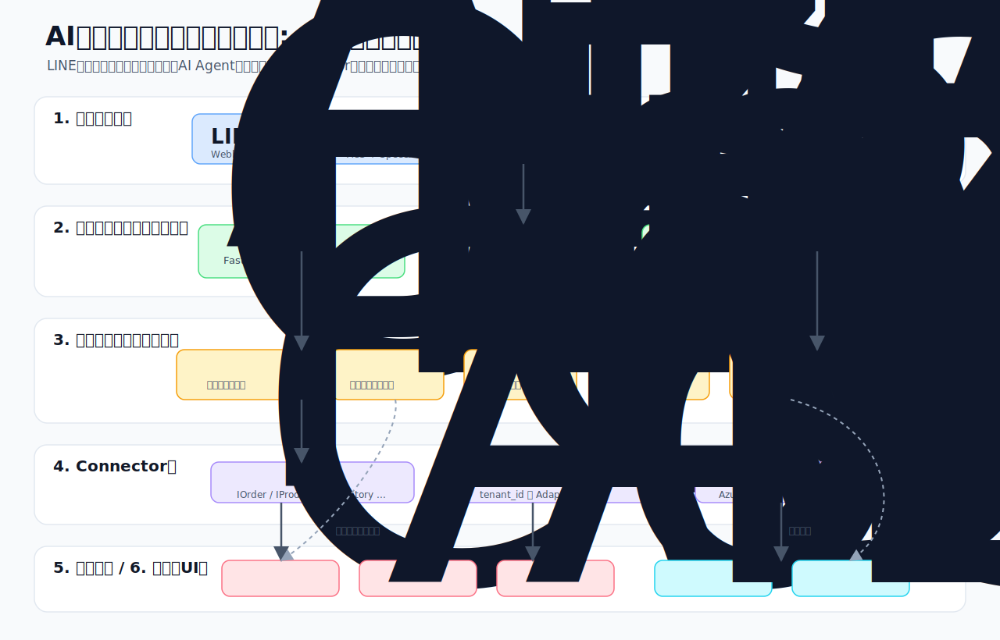

# 図解フロー

> 審査・デモ説明で、システムの価値と内部処理を短時間で共有するための図解まとめ。

## アーキテクチャ

LINE・電話などの入力チャネルを Azure Container Apps が受け、テナント解決とセッション管理を行う。
その後、Orchestrator が各専門 Agent を呼び分け、Connector 層を通じてテナント別のデータソースにアクセスする。
出力はダッシュボード、LINE返信、Learning Service に流れ、受注処理と学習が同時に進む。

## ペルソナ利用シナリオ

飲食店の店長は、朝の仕込み前に普段の言葉で LINE 注文を送るだけでよい。
AI Agent が商品名・数量・在庫・過去パターンを確認し、問題がなければ自動確定する。
曖昧さや異常値がある注文だけが確認待ちとして担当者のダッシュボードに上がる。

## ソフトウェア処理フロー

LINE Webhook または電話音声認識の結果は、FastAPI 入口で検証・正規化される。
Tenant Resolver が `tenant_id` を決め、Session Manager が新規注文か会話継続かを判定する。
Agent Thread 上で Orchestrator が Intake / Exception / Inventory / Communication を呼び分け、
Connector Factory がテナント別 Adapter を解決して Azure SQL、Cosmos DB、AI Search へアクセスする。
最終的に、顧客への返信、受注ドキュメント保存、ダッシュボード反映、Learning Service によるパターン更新まで完了する。
